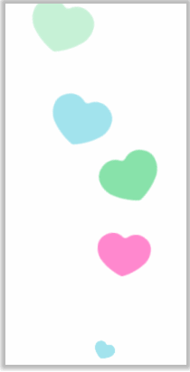

[](https://www.npmjs.org/package/bubble-hearts)
[](https://www.npmjs.org/package/bubble-hearts)
[](https://www.npmjs.org/package/bubble-hearts)
[](http://twitter.com/qq393464140)

# bubble-hearts
> (<3kb) 💖Bubble hearts animation.（Canvas 实现直播间点赞动画）

## What's it?

* Let images bubble in canvas, like hearts (etc).
* It's a familiar animation in live room.
* [Live Demo](https://lixinliang.github.io/live-demo/bubble-hearts/)



## Getting started

```
$ npm install --save-dev bubble-hearts
```

## Usage

#### #Init

```js
let stage = new BubbleHearts();
```

#### #Config

```js
let canvas = stage.canvas;
let context = stage.context;
canvas.width = 200;
canvas.height = 400;
canvas.style['width'] = '200px';
canvas.style['height'] = '400px';
```

#### #Display

```js
document.body.appendChild(canvas);
```

### #Animate

```js
let image = new Image;
image.onload = () => {
    stage.bubble(image);
};
image.src = src;
```

## Doc

#### #bubble

> stage.bubble( image : Image/Canvas, duration : Number, handler : Function )

| Param | Type | Required | Default | Description |
|---|---|---|---|---|
| image | Image/Canvas | * | - | Let this image bubbles in canvas. |
| duration | Number | - | 3000 | The duration of animation. |
| handler | Function | - | [@see handler](#handler) | The handler of animation. |

#### #handler

> handler( lifespan : Number )

| Param | Type | Description |
|---|---|---|
| lifespan | Number | From `1` to `0`; `1` means full live; `0` means over. |

* default handler

```js
/**
 * Create a default Render
 * @param  {Canvas} canvas canvas
 * @param  {Context} context context
 * @return {Function} handler
 */
function createRender ( image, canvas, context ) {

    const zoomInStage = random.uniformDiscrete(89, 91) / 100;
    const zoomInRest = 1 - zoomInStage;
    const basicScale = (random.uniformDiscrete(45, 60) + random.uniformDiscrete(45, 60)) / 100;
    let getScale = ( lifespan ) => {
        if (lifespan > zoomInStage) {
            return Math.max(((1 - lifespan) / zoomInRest).toFixed(2), 0.1) * basicScale;
        } else {
            return basicScale;
        }
    };

    const basicRotate = random.uniformDiscrete(-30, 30);
    let getRotate = ( lifespan ) => {
        return basicRotate;
    };

    const offset = 10;
    const basicTranslateX = canvas.width / 2 + random.uniformDiscrete(-offset, offset);
    const amplitude = (canvas.width - Math.sqrt(Math.pow(image.width, 2) + Math.pow(image.height, 2))) / 2 - offset;
    const wave = random.uniformDiscrete(amplitude * 0.8, amplitude) * (random.uniformDiscrete(0, 1) ? 1 : -1);
    const frequency = random.uniformDiscrete(250, 400);
    let getTranslateX = ( lifespan ) => {
        if (lifespan > zoomInStage) {
            return basicTranslateX;
        } else {
            return basicTranslateX + wave * Math.sin(frequency * (zoomInStage - lifespan) * Math.PI / 180);
        }
    };

    let getTranslateY = ( lifespan ) => {
        return image.height / 2 + (canvas.height - image.height / 2) * lifespan;
    };

    const fadeOutStage = random.uniformDiscrete(14, 18) / 100;
    let getAlpha = ( lifespan ) => {
        if (lifespan > fadeOutStage) {
            return 1;
        } else {
            return 1 - ((fadeOutStage - lifespan) / fadeOutStage).toFixed(2);
        }
    };

    return ( lifespan ) => {
        if (lifespan >= 0) {
            let scale = getScale(lifespan);
            let rotate = getRotate(lifespan);
            let translateX = getTranslateX(lifespan);
            let translateY = getTranslateY(lifespan);
            context.translate(translateX, translateY);
            context.scale(scale, scale);
            context.rotate(rotate * Math.PI / 180);
            context.globalAlpha = getAlpha(lifespan);
            context.drawImage(
                image,
                -image.width / 2,
                -image.height / 2,
                image.width,
                image.height
            );
            context.rotate(-rotate * Math.PI / 180);
            context.scale(1 / scale, 1 / scale);
            context.translate(-translateX, -translateY);
            context.globalAlpha = 1;
        } else {
            return true;
        }
    };
}
```

* simple custom example

```js
stage.bubble(image, 3000, function ( lifespan ) {
    // You got its lifespan, and from 1 to 0
    if (lifespan >= 0) {
        stage.context.drawImage(
            image,
            (canvas.width - image.width) / 2,
            // lifespan control its positionY, so that it will look like fly up
            (canvas.height - image.height) * lifespan,
            image.width,
            image.height
        );
    } else {
        // Return true to free the memory
        return true;
    }
});
```

#### #why `return true` ?

* lifespan from `1` to `0`, and go on to be negative.
* handler function repeats again and again to `drawImage`.
* `return true` is a flag to tell iterator to remove this handler, and stop repeating this handler again.

## License

MIT
